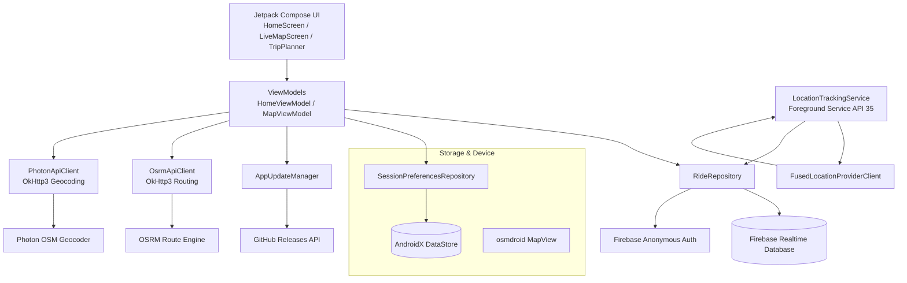

# 🏍️ PackSync: Motorbike Group Ride Live Tracking & Safety Radar

> **Never lose your pack again.** Real-time GPS convoy radar, route synchronization, and 1-tap glove-friendly stop alerts for motorbike group rides.

[](https://developer.android.com)
[](https://kotlinlang.org)
[](https://developer.android.com/jetpack/compose)
[-green.svg?logo=openstreetmap)](https://github.com/osmdroid/osmdroid)
[](https://project-osrm.org/)
[](https://firebase.google.com)
[-critical.svg)](https://developer.android.com/about/versions/14/changes/fgs-types-required#location)
[](LICENSE)

---

## 📖 Overview

Motorbike group rides get separated fast. Traffic lights split the pack, blind mountain twisties cut visual contact, mechanical faults or punctures leave riders stranded behind, and pulling over to unlock a phone with heavy riding gloves is frustrating and dangerous.

**PackSync** is a native Android application built specifically for motorcyclists. It provides zero-friction group convoy tracking: riders join with an ephemeral **6-character code**, share live GPS coordinates continuously via an **Android 14+ compliant Foreground Location Service**, view real-time pack telemetry on an outdoor-optimized **dark cockpit HUD**, and dispatch instant status updates with **large glove-friendly 1-tap buttons**.

Best of all, PackSync is built on an open-source mapping foundation (**osmdroid + Photon + OSRM**) and the free Firebase Spark tier — requiring **zero Google Maps API keys or credit card billing**.

---

## ⚡ Key Features

### 🔑 Zero-Friction 6-Character Ride Codes
- Create or join active ride sessions in seconds with an easy-to-share 6-character room code (e.g. `MOTO84`).
- **No passwords or account registration**: Uses Firebase Anonymous Authentication to issue unique rider identities instantly without sign-up friction at the trailhead.
- **Local Session Persistence**: Uses AndroidX DataStore to remember active and previous ride codes so riders can rejoin with a single tap after restarting the app.

### 🛰️ Real-Time GPS Convoy Telemetry
- Sub-second bi-directional location synchronization via **Firebase Realtime Database**.
- High-accuracy position tracking powered by Google Play Services **FusedLocationProviderClient**.
- Displays each rider's marker, bearing, current speed, last ping time, and distance to destination.

### 🛡️ Android 14+ Foreground Location Service
- Runs as an active Foreground Service (`FOREGROUND_SERVICE_LOCATION`) with an ongoing notification.
- **Continuous background transmission**: Never drops GPS or sync even when the phone screen is locked, in a pocket or tank bag, or running navigation apps (Google Maps, Waze) in the foreground.
- Battery-optimized throttling with automatic retry logic and clean service teardown when leaving the ride.

### 🗺️ Open-Source Map & Routing Engine (Zero API Keys Needed)
- **OpenStreetMap (osmdroid)**: Renders vector map tiles offline and online without requiring proprietary Google Maps SDK keys or billing accounts.
- **Photon Geocoding**: Real-time address and landmark search powered by OpenStreetMap Nominatim data.
- **OSRM (Open Source Routing Machine)**: Calculates optimal motorcycle riding routes, calculates cumulative distance and ETA, and automatically syncs the encoded polyline geometry across all connected riders.

### 🧤 1-Tap Glove-Friendly Stop & Hazard Dispatch
No typing, no tiny buttons. Riders can update their status with large, tactile buttons easily tapped while wearing motorcycle gloves:

| Status | Emoji | Color Code | Scenario |
| :--- | :---: | :---: | :--- |
| **Riding** | 🏍️ | `Green` | Moving normally with the pack |
| **Refueling** | ⛽ | `Amber` | Fuel stop / gas station pit stop |
| **Tire Puncture** | 🔧 | `Orange` | Mechanical breakdown or flat tire |
| **Rest Stop** | ☕ | `Blue` | Breather, coffee, or scenic pause |
| **Emergency SOS** | 🚨 | `Red` | Urgent distress, crash, or medical need |
| **Other Stop** | ⚠️ | `Slate` | Regrouping or miscellaneous pause |

### 🚨 High-Priority Emergency Radar
- Tapping **Emergency SOS** instantly flags the rider's marker with high-visibility pulsing red telemetry.
- Broadcasts high-importance heads-up notifications with vibration patterns to all riders in the convoy.

### 📱 Dark Cockpit HUD & Live Rider Drawer
- Built 100% with **Jetpack Compose** and **Material 3**.
- Features an ultra-dark `#090B0E` cockpit theme with electric amber `#FFA000` accents engineered specifically for outdoor visibility against sun glare on motorcycle handlebars.
- Bottom sheet drawer displays all convoy members, live distance to pack leader, individual GPS accuracy, and one-tap camera centering.

### 🔄 In-App Seamless APK Updates
- Built-in `AppUpdateManager` directly queries the repository's GitHub Releases API.
- Detects new semantic versions and build numbers.
- Downloads the latest APK in the background with real-time download progress and triggers Android's package installer via secure `FileProvider` — completely eliminating dependencies on Google Play Store or Firebase App Tester.

---

## 🛠️ Architecture & Technology Stack



### Detailed Tech Stack Matrix

| Layer / Concern | Technology | Version | Purpose & Rationale |
| :--- | :--- | :--- | :--- |
| **Language** | Kotlin | `2.0.21` | Modern idiomatic language with Coroutines, StateFlow, Data Classes, and null safety. |
| **UI Framework** | Jetpack Compose | BOM `2024.09.00` | Modern declarative UI, eliminating XML layouts, ViewBinding, and RecyclerView boilerplate. |
| **Design System** | Material 3 | `1.3.0` | Dynamic color theming, bottom sheets, sliders, tactile dialogs, and high-contrast HUD cards. |
| **Navigation** | Navigation Compose | `2.8.3` | Single-Activity Compose navigation architecture (`MainActivity` -> `HomeScreen` / `LiveMapScreen`). |
| **Map Rendering** | osmdroid-android | `6.1.18` | OpenStreetMap tile renderer, marker overlays, polyline routing; free and independent of Google Maps. |
| **Routing** | OSRM API + Polyline | Custom / OSRM | Turn-by-turn route geometry generation, polyline decoding, distance, and duration calculations. |
| **Geocoding** | Photon API (Komoot) | REST via OkHttp | Instant address autocompletion and landmark coordinate lookup. |
| **HTTP Client** | OkHttp | `4.12.0` | Asynchronous REST calls for geocoding, route queries, and streaming APK downloads. |
| **Backend Sync** | Firebase Realtime Database | BOM `33.5.1` | Ultra-low latency bi-directional JSON synchronization of rider GPS positions and status. |
| **Authentication** | Firebase Anonymous Auth | BOM `33.5.1` | Instant, zero-credential anonymous authentication yielding unique rider UIDs. |
| **GPS & Location** | Google Play Services Location | `21.3.0` | High-accuracy battery-aware `FusedLocationProviderClient` GPS updates. |
| **Background Work**| Android Foreground Service | Android 14+ (API 35) | `FOREGROUND_SERVICE_LOCATION` ensures continuous location updates when screen is off. |
| **Local Storage** | Jetpack DataStore Preferences| `1.1.1` | Safe, asynchronous key-value persistence for ride session history and rider names. |
| **OTA Updates** | AppUpdateManager + FileProvider | Native Android | Self-hosted GitHub Releases check, background download, and secure APK installation. |
| **CI/CD** | GitHub Actions + Firebase App Dist | `5.0.0` | Automated debug/release builds and automated distribution to rider tester groups. |

---

## 📂 Project Directory Structure

```text
app/src/main/
├── AndroidManifest.xml                  # App manifest declaring foreground service & location permissions
├── java/com/ridesafe/app/
│   ├── MainActivity.kt                  # Single-activity host with Compose NavHost & update listeners
│   ├── RideSafeApp.kt                   # Application subclass initializing osmdroid & notification channels
│   ├── data/
│   │   ├── model/
│   │   │   ├── AppUpdateInfo.kt         # Model for GitHub Releases update metadata
│   │   │   ├── LocalRideSession.kt      # DataStore model for recent ride sessions
│   │   │   ├── PlaceSuggestion.kt       # Photon geocoding autocomplete place result
│   │   │   ├── Rider.kt                 # Live telemetry: uid, name, lat, lng, speed, bearing, status
│   │   │   ├── RiderStatus.kt           # Enum for Riding, Refueling, Puncture, Rest, Emergency, Other
│   │   │   ├── RouteResult.kt           # OSRM route payload with geometry, distance, duration
│   │   │   └── TripInfo.kt              # Planned route details synced to Firebase RTDB
│   │   ├── network/
│   │   │   ├── OsrmApiClient.kt         # OkHttp client querying OSRM route service
│   │   │   └── PhotonApiClient.kt       # OkHttp client querying Photon Geocoding API
│   │   └── repository/
│   │       ├── RideRepository.kt        # Firebase RTDB repository managing room lifecycle & streams
│   │       └── SessionPreferencesRepository.kt # DataStore repository for local sessions & rider name
│   ├── service/
│   │   └── LocationTrackingService.kt   # Foreground Service for persistent GPS broadcasting & notifications
│   ├── ui/
│   │   ├── components/
│   │   │   └── UpdateDialog.kt          # In-app APK download progress & release notes modal
│   │   ├── navigation/
│   │   │   └── NavGraph.kt              # Navigation routes: Home and LiveMap
│   │   ├── screens/
│   │   │   ├── home/
│   │   │   │   ├── HomeScreen.kt        # Ride creation, code entry, recent rides, update trigger
│   │   │   │   ├── HomeViewModel.kt     # State management for ride creation, validation, history
│   │   │   │   └── TripPlannerModal.kt  # Route destination search, waypoints & preview
│   │   │   └── map/
│   │   │       ├── LiveMapScreen.kt     # osmdroid map, HUD cockpit, stop drawer, speed gauge
│   │   │       ├── MapViewModel.kt      # Live location sync, route overlay, stop status dispatch
│   │   │       ├── RiderListBottomSheet.kt # Convoy members sheet with distance & connection stats
│   │   │       └── StopStatusDialog.kt  # 1-tap glove-friendly status selector dialog
│   │   └── theme/
│   │       ├── Color.kt                 # Neon amber, emerald green, racing orange, cockpit dark colors
│   │       ├── Theme.kt                 # Material 3 dark cockpit theme configuration
│   │       └── Type.kt                  # Typography scale
│   └── util/
│       ├── AppUpdateManager.kt          # GitHub Releases APK download & FileProvider installer
│       ├── LocationUtils.kt             # Haversine distance, speed conversion, bearing helpers
│       ├── PermissionHelper.kt          # Runtime location & notification permission checks
│       └── PolylineUtils.kt             # Encoded polyline decoder and distance/time formatters
└── res/
    ├── drawable/                        # Custom vector icons, app logo, and status markers
    ├── values/                          # Strings, colors, and styles
    └── xml/                             # FileProvider paths for APK updates
```

---

## 🚀 Getting Started

### Prerequisites
- **Android Studio**: Ladybug (2024.2.1+) or newer.
- **JDK**: Java 17 (configured in `Gradle Settings`).
- **Android Device / Emulator**: Running Android 8.0+ (API 26) through Android 15 (API 35).
- **Google Account**: For Firebase Realtime Database setup.

### Step 1: Clone the Repository
```bash
git clone https://github.com/Safiur6296/BhajiRide.git
cd BhajiRide
```

### Step 2: Configure Firebase
1. Open the [Firebase Console](https://console.firebase.google.com/) and create a project (e.g., `PackSync`).
2. Add an Android app with Package Name: `com.ridesafe.app`.
3. Download `google-services.json` and place it in the `app/` folder:
   ```text
   app/google-services.json
   ```
4. In Firebase Console:
   - Navigate to **Authentication** > **Sign-in method** > Enable **Anonymous**.
   - Navigate to **Realtime Database** > **Create Database**.
   - Under the **Rules** tab, apply rules allowing read/write access to ride rooms:
     ```json
     {
       "rules": {
         "rides": {
           "$rideCode": {
             ".read": true,
             ".write": true
           }
         }
       }
     }
     ```
   - Click **Publish**.

### Step 3: Build & Run
You can run the app directly using Gradle:
```bash
# Build Debug APK
./gradlew assembleDebug

# Install on connected device or emulator
./gradlew installDebug
```
Or open the project in **Android Studio** and click **Run (Shift + F10)**.

---

## 🧪 Testing with Dual Emulators (Simulating a Pack Ride)

You can easily simulate a multi-rider pack on your development machine using two Android Studio Virtual Devices:

1. **Launch Two Emulators**:
   - Open **Device Manager** in Android Studio.
   - Launch two devices (e.g., *Pixel 8 - API 34* and *Pixel 7 - API 34*).
2. **Install & Launch PackSync** on both emulators.
3. **Start the Ride**:
   - **On Device A (Lead Rider)**:
     - Enter rider name: `Alex Vance`.
     - Tap **Create Ride Session**.
     - Note the generated 6-character code (e.g., `MOTO84`).
   - **On Device B (Pack Rider)**:
     - Enter rider name: `Jordan Cole`.
     - Enter ride code `MOTO84` and tap **Join Ride**.
4. **Simulate Real-Time Movement**:
   - On **Emulator A**, open the three dots (`...`) in the emulator toolbar to access **Extended Controls**.
   - Navigate to **Location** > **Routes**.
   - Select a sample route or import a GPX track, choose a speed (e.g., 60 km/h), and click **Play Route**.
   - Watch **Device B**: Device A's marker will smoothly traverse the map in real time!
5. **Test Stop Communication**:
   - On **Device A**, tap **My Status** and choose **⛽ Refueling** or **🔧 Tire Puncture**.
   - Instantly on **Device B**, Device A's marker changes color and an alert badge updates in the Convoy Sheet.
   - Tap **Resume Riding** to return to green.

---

## 🔒 Permissions & Security

PackSync implements transparent, least-privilege permission management:

- **Location (`ACCESS_FINE_LOCATION`, `ACCESS_COARSE_LOCATION`)**: Required to obtain accurate GPS telemetry for sharing with your convoy.
- **Background Location (`ACCESS_BACKGROUND_LOCATION`)**: Enables seamless updates when the app is placed in the background or minimized.
- **Foreground Service (`FOREGROUND_SERVICE_LOCATION`)**: Compliant with Android 14 requirements to ensure the operating system does not kill tracking during active rides.
- **Notifications (`POST_NOTIFICATIONS`)**: Required for the persistent tracking notification and urgent emergency SOS alerts.
- **Install Packages (`REQUEST_INSTALL_PACKAGES`)**: Safely triggers direct in-app APK installation via `FileProvider` when updates are fetched from GitHub Releases.
- **Privacy Assurance**: All sessions are ephemeral, anonymous, and scoped strictly to the 6-character ride code. No personal identifying information (PII) or passwords are ever required.

---

## 🤝 Contributing

Contributions, feature ideas, and pull requests are warmly welcomed!
1. Fork the Project.
2. Create your Feature Branch (`git checkout -b feature/AmazingFeature`).
3. Commit your Changes (`git commit -m 'feat: Add AmazingFeature'`).
4. Push to the Branch (`git push origin feature/AmazingFeature`).
5. Open a Pull Request.

---

## 📄 License

Distributed under the MIT License. See `LICENSE` for more information.

---

<p align="center">
  <b>Ride safe. Ride together. PackSync.</b><br/>
  Crafted with ❤️ for the global motorcycle community.
</p>
